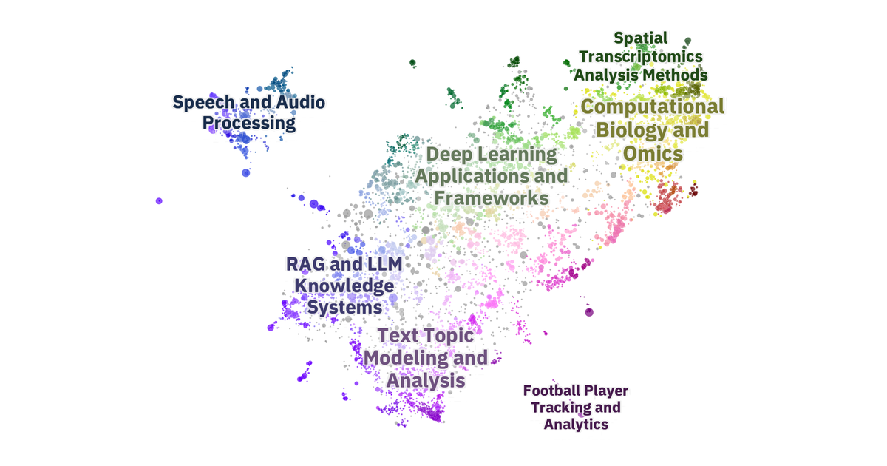
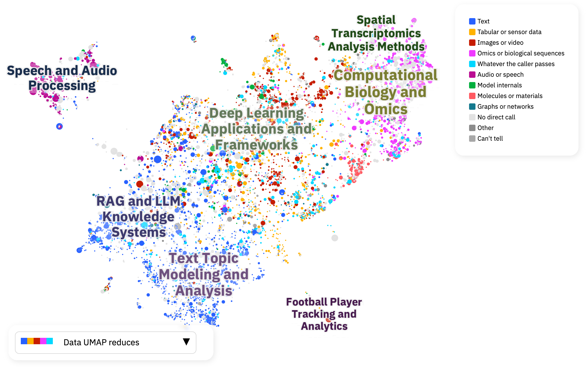
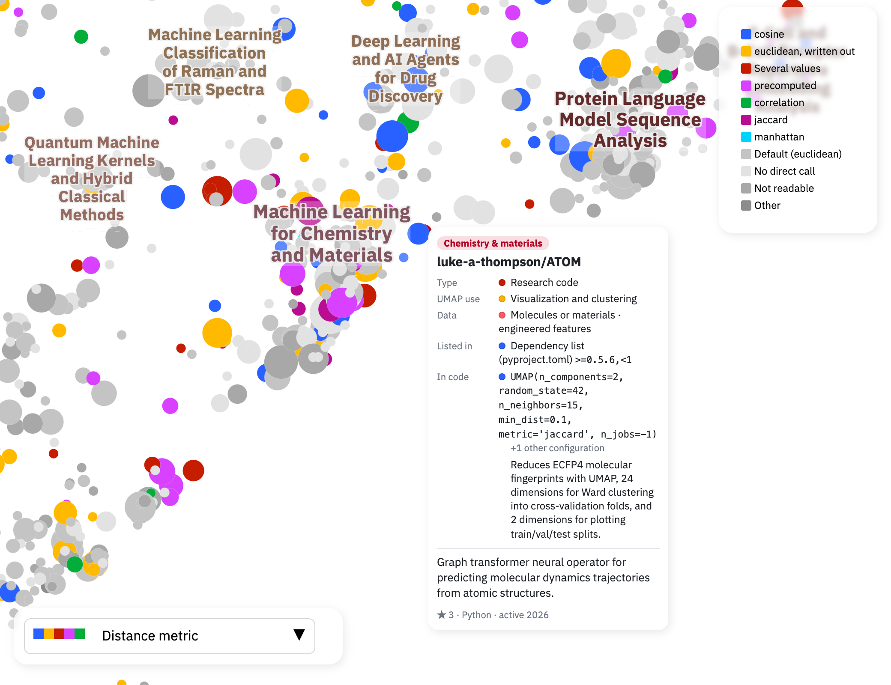

<!--
Category: Show and tell
Title: A map of umap-learn's dependents, and what their code does with UMAP

Posted to https://github.com/lmcinnes/umap/discussions, with the three image paths below
replaced by raw.githubusercontent.com links pinned to the commit that added this folder.
-->

I've been using UMAP, Toponymy and DataMapPlot to make maps of document collections, and I got curious about what a map of UMAP's own users would look like. So I made one.

- **Interactive map:** https://stevenfazzio.com/dependents-map/umap-learn/
- **Code and write-up:** https://github.com/stevenfazzio/dependents-map

Each point is a project that depends on `umap-learn`, placed by the meaning of its README, and point size shows GitHub stars.

### How it was made

I scraped GitHub's "Dependents" pages for this repository (there's no API for them), embedded each project's README with Qwen3-Embedding-8B, and reduced the embeddings to 2-d with UMAP. Toponymy found and named the regions, and DataMapPlot rendered the page.

READMEs turned out to say very little about UMAP itself (only 27% mention it at all), so the pipeline also reads the code. It parses every Python file and notebook in every repository (791,521 files) for how UMAP is imported and called, and then Claude reads the code around each call and says what data goes in and what the output is used for.

### Some things I found

- **GitHub's dependents count is generous.** The page header says 25,638 repositories and the list ends at 13,743. After dropping forks and copies there are 10,509 candidates, of which 5,031 call UMAP in their own code. More than half of the rest only have `umap-learn` in a `pip freeze` or a lock file. The map keeps the 7,250 that show some sign of UMAP in their code, their own dependency list or their README.
- **Plenty of projects run UMAP without naming it.** 629 call `scanpy.pp.neighbors` and 520 build a BERTopic model, and 385 and 193 of them never call UMAP themselves.
- **The metric mostly follows the data.** Of the projects reducing neural embeddings, 36% set cosine and 48% leave the default. Cosine is set by 55% of the callers in the RAG region and by 2% in the scanpy tutorials region. Only 26 projects set jaccard and nothing else, and 17 of them are reducing molecular fingerprints.
- **Seeds.** 2,860 projects give `random_state` a value, and for 1,976 of them it's 42. The fifth most common seed is 86, and all 36 projects using it are copies of GraphRAG's layout code. 166 projects write `n_jobs=1` next to their seed, 74 pass a seed and a different `n_jobs` in the same call, and 36 filter the `n_jobs` warning by its text.
- **Newer projects seed everything.** Of the calling projects created in 2019, 30% set `random_state` in every call. For those created in 2024 it's 45%, for 2025 it's 64%, and for 2026 it's 80%. I can't show why from this data, but my guess is AI coding assistants: the 59 projects created in 2024 with a `CLAUDE.md`, `AGENTS.md` or similar in their root already seeded every call 73% of the time, against 44% for the rest.
- **A lot of what looks like a field's habit is one file copied many times.** In the speech region, 121 of 352 callers only ever write a bare `umap.UMAP()`, which is the call in Coqui TTS and in the many copies of Real-Time-Voice-Cloning. The football-tracking island is mostly `umap.UMAP(n_components=3)`, the call in roboflow/sports.

*Coloured by the kind of data each project reduces. The layout comes from the READMEs and the colours from the code.*

*The chemistry region coloured by distance metric, with one project's card open.*

The colormaps cover what UMAP is used for, the data it reduces, the features used, the metric, the seed and the version asked for. The search field holds arguments and versions as well as names, so `metric=cosine`, `umap-learn==0.5.3`, `fuzzy_simplicial_set` and `HDBSCAN` all work.

A few caveats: it's a snapshot from October 2026, it only covers what GitHub's dependency graph lists, and it only reads Python. The purposes and data types are a model's reading of the code, so individual cards will sometimes be wrong.

The parsed calls for all 5,031 projects are stored, and I'm happy to run other queries against them.
